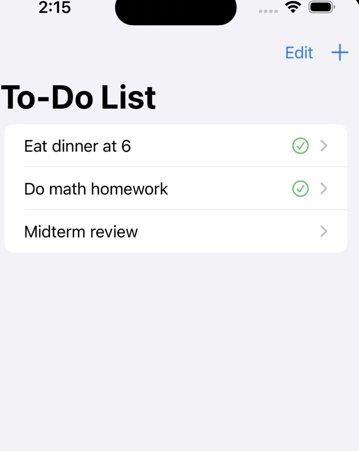
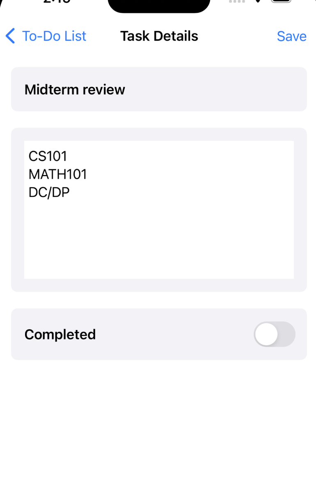

# ToDoListApp

ToDoListApp is a simple and intuitive to-do list application I built with SwiftUI and CoreData. It allows users to add, delete, and manage tasks efficiently. This project demonstrates the use of SwiftUI for the user interface and CoreData for data persistence. It also includes unit and UI tests to ensure the functionality and reliability of the application.

## Features

- **Add Tasks**: Easily add new tasks with a title.
- **View Tasks**: View a list of all tasks, sorted by their creation time.
- **Edit Tasks**: Edit the details of existing tasks.
- **Delete Tasks**: Delete tasks when they are no longer needed.
- **Mark Tasks as Completed**: Mark tasks as completed and visually distinguish them from incomplete tasks.

## Screenshots




## Installation

To run the ToDoListApp on your local machine, follow these steps:

1. **Clone the Repository**:
    ```bash
    git clone https://github.com/heming277/ToDoListApp.git
    cd ToDoListApp
    ```

2. **Open in Xcode**:
    - Open the `ToDoListApp.xcodeproj` file in Xcode.

3. **Build and Run**:
    - Select your target device or simulator and click the run button in Xcode.

## Usage

- **Adding a Task**:
    - Click on the "+" button in the top-right corner.
    - Enter the task title and click "Add".

- **Viewing Task Details**:
    - Tap on any task in the list to view and edit its details.

- **Marking a Task as Completed**:
    - Toggle the "Completed" switch in the task details view.

- **Deleting a Task**:
    - Swipe left on a task in the list and tap the "Delete" button.

## Testing

The project includes both unit tests and UI tests.

### Running Unit Tests

To run the unit tests, follow these steps:

1. **Open the Project in Xcode**:
    - Open the `ToDoListApp.xcodeproj` file in Xcode.

2. **Run Tests**:
    - Select the `ToDoListAppTests` target.
    - Press `Cmd+U` or go to `Product > Test` to run the unit tests.

### Running UI Tests

To run the UI tests, follow these steps:

1. **Open the Project in Xcode**:
    - Open the `ToDoListApp.xcodeproj` file in Xcode.

2. **Run Tests**:
    - Select the `ToDoListAppUITests` target.
    - Press `Cmd+U` or go to `Product > Test` to run the UI tests.

